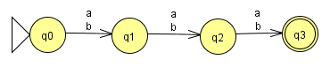

# AFD Exercício 1

Implementação java recursivo de um AFD A1, que reconhece a linguagem:

L = {w &isin; {a,b}* | w possui tamanho 3}
- Ex.: aba, aaa, bbb, bbb, .... 

Definição da linguagem:
- L = <{a, b}, {s0, s1, s2, s3}, s0, δ, {s3}>, 
- onde δ é:
    - δ{s0,a) = s1 	
    - δ{s0,b) = s1
    - δ{s1,a) = s2	
    - δ{s1,b) = s2
    - δ{s2,a) = s3	
    - δ{s2,b) = s3

AFD:

Arquivo JFlap:
[AFD_ex1_v1.jff](AFD_ex1_v1.jff)